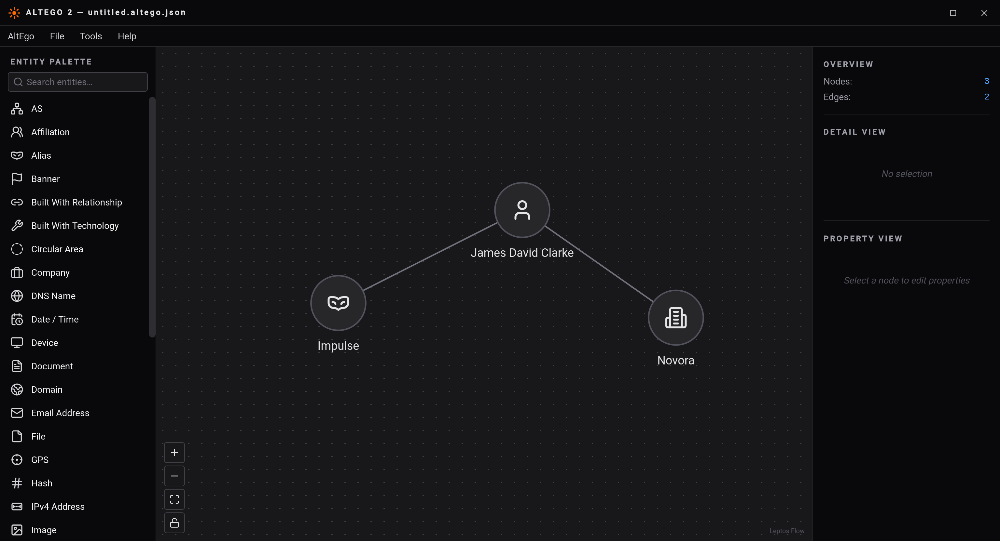

# AltEgo 2
A investigative tool like Maltego.

See [Prerequisites](#prerequisites) section.

```sh
# Build and develop for desktop
cargo tauri dev

# Build and release for desktop
cargo tauri build
```

## Prerequisites

```sh
# Tauri CLI
cargo install tauri-cli --version "^2.0.0" --locked

# Rust stable (required by Leptos)
rustup toolchain install stable --allow-downgrade

# WASM target
rustup target add wasm32-unknown-unknown

# Trunk WASM bundler
cargo install --locked trunk

# `wasm-bindgen` for Apple M1 chips (required by Trunk)
cargo install --locked wasm-bindgen-cli

# `esbuild` as dependency of `tauri-sys` crate (used in UI)
npm install --global --save-exact esbuild

# Optional: `tailwindcss` for UI styling
npm install --global tailwindcss
```

## Running

### Run in Dev mode

```bash
cargo tauri dev
```

### Build in Production

```bash
cargo tauri build
```
